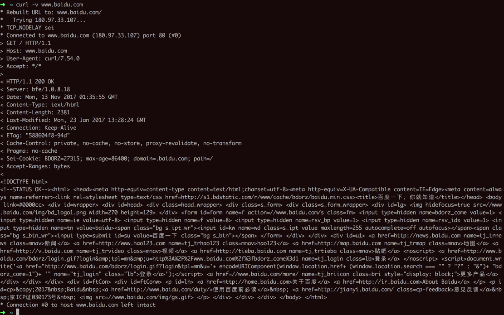

# HTTP内部流程
其实内部都是通用的HTTP的逻辑：
- 发送HTTP的请求
- 接受到响应后
    - 解析并显示出对应的内容
    - 解析得到所需要的数据

那如何才能看到内部的HTTP的请求和响应到底是什么样的呢？
有很多方式可以实现查看内部到底发送了什么样的HTTP请求，和接收到了什么样的响应：
- 对于浏览器访问网页
    - 可以用`Chrome`/`Safari`/`Firefox`等浏览器自带的调试工具：`开发者工具`
    - 可以用其他工具去模拟
        - 比如：命令行工具`curl`
- 对于写代码调用后台接口
    - 可以用postman去模拟和查看

下面详细介绍如何查看内部的具体流程：

## 用Chrome的开发者工具去查看
先去打开：
右上角 三个点-》更多工具-》开发者工具


点击到Network列，然后再去访问地址www.baidu.com

就可以看到会有一堆的内容列出来，点击第一个www.baidu.com的Header

即可看到，对应的Request和Response的信息：


通过点击Request Headers和Response Headers的view source可以看到未被解析之前的原始内容：


对应的原始内容为：

Request请求：
```bash
GET / HTTP/1.1
Host: www.baidu.com
Connection: keep-alive
Cache-Control: max-age=0
User-Agent: Mozilla/5.0 (Macintosh; Intel Mac OS X 10_12_6) AppleWebKit/537.36 (KHTML, like Gecko) Chrome/61.0.3163.100 Safari/537.36
Upgrade-Insecure-Requests: 1
Accept: text/html,application/xhtml+xml,application/xml;q=0.9,image/webp,image/apng,*/*;q=0.8
Accept-Encoding: gzip, deflate, br
Accept-Language: zh-CN,zh;q=0.8,en;q=0.6
Cookie: BAIDUID=6720BF4EAED8C8448EB6540DAF83BE56:FG=1; BIDUPSID=6720BF4EAED8C8448EB6540DAF83BE56; PSTM=1449798993; MCITY=-224%3A; BD_CK_SAM=1; PSINO=3; BD_HOME=0; H_PS_PSSID=1430_24568_21116_24880_20929; BD_UPN=123253
```

Response响应：
```bash
HTTP/1.1 200 OK
Bdpagetype: 1
Bdqid: 0xd4bdc47c00000909
Bduserid: 0
Cache-Control: private
Connection: Keep-Alive
Content-Encoding: gzip
Content-Type: text/html; charset=utf-8
Cxy_all: baidu+1ea6be4d211f802306f9e10940507eba
Date: Mon, 13 Nov 2017 01:32:41 GMT
Expires: Mon, 13 Nov 2017 01:32:06 GMT
Server: BWS/1.1
Set-Cookie: BDSVRTM=0; path=/
Set-Cookie: BD_HOME=0; path=/
Set-Cookie: H_PS_PSSID=1430_24568_21116_24880_20929; path=/; domain=.baidu.com
Strict-Transport-Security: max-age=172800
Vary: Accept-Encoding
X-Powered-By: HPHP
X-Ua-Compatible: IE=Edge,chrome=1
Transfer-Encoding: chunked
```
## 用curl工具去模拟浏览器访问百度的过程

在命令行中输入：
```bash
curl -v www.baidu.com
```
返回的结果是：
```bash
➜  ~ curl -v www.baidu.com
* Rebuilt URL to: www.baidu.com/
*   Trying 180.97.33.107...
* TCP_NODELAY set
* Connected to www.baidu.com (180.97.33.107) port 80 (#0)
> GET / HTTP/1.1
> Host: www.baidu.com
> User-Agent: curl/7.54.0
> Accept: */*
>
< HTTP/1.1 200 OK
< Server: bfe/1.0.8.18
< Date: Mon, 13 Nov 2017 01:35:55 GMT
< Content-Type: text/html
< Content-Length: 2381
< Last-Modified: Mon, 23 Jan 2017 13:28:24 GMT
< Connection: Keep-Alive
< ETag: "588604f8-94d"
< Cache-Control: private, no-cache, no-store, proxy-revalidate, no-transform
< Pragma: no-cache
< Set-Cookie: BDORZ=27315; max-age=86400; domain=.baidu.com; path=/
< Accept-Ranges: bytes
<
<!DOCTYPE html>
<!--STATUS OK--><html> <head><meta http-equiv=content-type content=text/html;charset=utf-8><meta http-equiv=X-UA-Compatible content=IE=Edge><meta content=always name=referrer><link rel=stylesheet type=text/css href=http://s1.bdstatic.com/r/www/cache/bdorz/baidu.min.css><title>百度一下，你就知道</title></head>; <body link=#0000cc> <div id=wrapper> <div id=head> <div class=head_wrapper> <div class=s_form> <div class=s_form_wrapper> <div id=lg>  </div> <form id=form name=f action=//www.baidu.com/s class=fm> <input type=hidden name=bdorz_come value=1> <input type=hidden name=ie value=utf-8> <input type=hidden name=f value=8> <input type=hidden name=rsv_bp value=1> <input type=hidden name=rsv_idx value=1> <input type=hidden name=tn value=baidu><span class="bg s_ipt_wr"><input id=kw name=wd class=s_ipt value maxlength=255 autocomplete=off autofocus></span><span class="bg s_btn_wr"><input type=submit id=su value=百度一下 class="bg s_btn"></span> </form> </div> </div> <div id=u1> <a href=http://news.baidu.com name=tj_trnews class=mnav>新闻</a> <a href=http://www.hao123.com name=tj_trhao123 class=mnav>hao123</a> <a href=http://map.baidu.com name=tj_trmap class=mnav>地图</a> <a href=http://v.baidu.com name=tj_trvideo class=mnav>视频</a> <a href=http://tieba.baidu.com name=tj_trtieba class=mnav>贴吧</a> <noscript> <a href=http://www.baidu.com/bdorz/login.gif?login&amp;tpl=mn&amp;u=http%3A%2F%2Fwww.baidu.com%2f%3fbdorz_come%3d1 name=tj_login class=lb>登录</a> </noscript> <script>document.write('<a href="http://www.baidu.com/bdorz/login.gif?login&tpl=mn&u=';+ encodeURIComponent(window.location.href+ (window.location.search === "" ? "?" : "&")+ "bdorz_come=1")+ '" name="tj_login" class="lb">登录</a>');</script> <a href=//www.baidu.com/more/ name=tj_briicon class=bri style="display: block;">更多产品</a> </div> </div> </div> <div id=ftCon> <div id=ftConw> <p id=lh> <a href=http://home.baidu.com>关于百度</a>; <a href=http://ir.baidu.com>About Baidu</a> </p> <p id=cp>&copy;2017&nbsp;Baidu&nbsp;<a href=http://www.baidu.com/duty/>使用百度前必读</a>&nbsp; <a href=http://jianyi.baidu.com/ class=cp-feedback>意见反馈</a>&nbsp;京ICP证030173号&nbsp; ; </p> </div> </div> </div> </body> </html>
* Connection #0 to host www.baidu.com left intact
```



## 用`postman`去模拟前面的调用后台接口的登录过程


