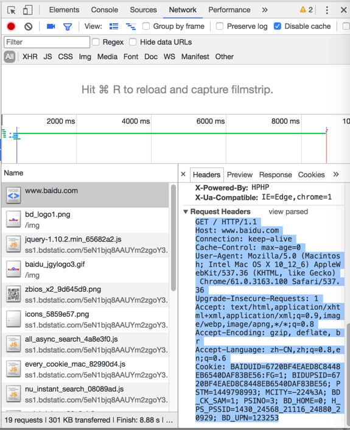

# HTTP内部流程
其实内部都是通用的HTTP的逻辑：
- 发送HTTP的请求
- 接受到响应后
    - 解析并显示出对应的内容
    - 解析得到所需要的数据

那如何才能看到内部的HTTP的请求和响应到底是什么样的呢？
有很多方式可以实现查看内部到底发送了什么样的HTTP请求，和接收到了什么样的响应：
- 对于浏览器访问网页
    - 可以用`Chrome`/`Safari`/`Firefox`等浏览器自带的调试工具：`开发者工具`
    - 可以用其他工具去模拟
        - 比如：命令行工具`curl`
- 对于写代码调用后台接口
    - 可以用postman去模拟和查看

下面详细介绍如何查看内部的具体流程：

## 用Chrome的开发者工具去查看
先去打开：
右上角 三个点-》更多工具-》开发者工具


点击到Network列，然后再去访问地址www.baidu.com

就可以看到会有一堆的内容列出来，点击第一个www.baidu.com的Header

即可看到，对应的Request和Response的信息：


通过点击Request Headers和Response Headers的view source可以看到未被解析之前的原始内容：



对应的原始内容为：

Request请求：
```bash
GET / HTTP/1.1
Host: www.baidu.com
Connection: keep-alive
Cache-Control: max-age=0
User-Agent: Mozilla/5.0 (Macintosh; Intel Mac OS X 10_12_6) AppleWebKit/537.36 (KHTML, like Gecko) Chrome/61.0.3163.100 Safari/537.36
Upgrade-Insecure-Requests: 1
Accept: text/html,application/xhtml+xml,application/xml;q=0.9,image/webp,image/apng,*/*;q=0.8
Accept-Encoding: gzip, deflate, br
Accept-Language: zh-CN,zh;q=0.8,en;q=0.6
Cookie: BAIDUID=6720BF4EAED8C8448EB6540DAF83BE56:FG=1; BIDUPSID=6720BF4EAED8C8448EB6540DAF83BE56; PSTM=1449798993; MCITY=-224%3A; BD_CK_SAM=1; PSINO=3; BD_HOME=0; H_PS_PSSID=1430_24568_21116_24880_20929; BD_UPN=123253
```


