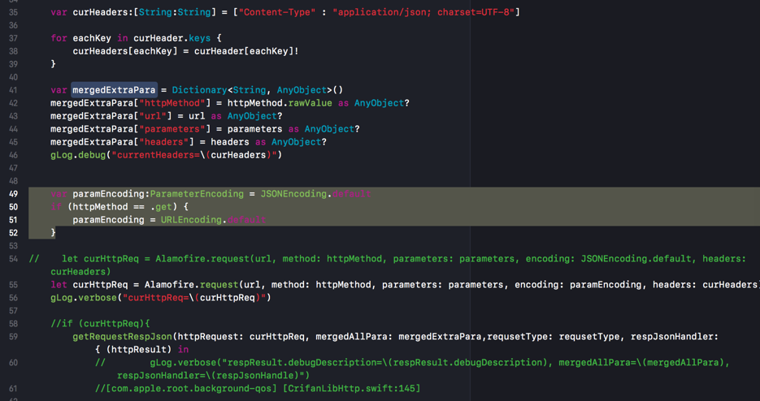

# HTTP的请求参数和参数编码

下面介绍HTTP的请求参数`Request Parameters`和请求参数的编码`Request Parameters Encoding`

## GET的请求的参数：`query string`
典型的是：

GET：参数想要放在url中以`?key1=value1&key2=value2`的形式

则有两种做法：

* 自己把参数组合成对应的格式，放到url中
* 把参数（字典，对象等）调用url encode函数去编码，生成对应的格式（再放到url中）

其他一些注意和解释：

其他一些注意和解释：

* GET 请求有长度限制
  * 所以query string一般被限制在1024个字节
    * 超过限制则后台无法解析参数
* GET 请求可被缓存
* GET 请求保留在浏览器历史记录中
* GET 请求可被收藏为书签
* GET 请求不应在处理敏感数据时使用
* GET 请求只应当用于取回数据

## POST的请求的参数：`post body`
典型的是：把一堆的参数，放到`post`的`body`中，格式一般都是`json`格式

则一般也有两种做法：

- 自己把参数（对象，字典等），转换为对应的json字符串
- 调用库提供的方法去encode你的参数对象为json


其他一些解释：

- POST 请求不会被缓存
- POST 请求不会保留在浏览器历史记录中
- POST 不能被收藏为书签
- POST 请求对数据长度没有要求


## GET和POST的请求的参数的编码

举例：
### http库axios中create时支持的config中的paramsSerializer

就支持利用其他序列化的库，比如：
- Javascript中的：
  - qs库
    - [https://www.npmjs.com/package/qs](https://www.npmjs.com/package/qs)
    - 举例：
      - `Qs.stringify(params, {arrayFormat: 'brackets'})`

### Alamofire中，对于get的参数支持url encoding，对于post支持json encoding
所以代码可以写成：
```swift
    var paramEncoding:ParameterEncoding = JSONEncoding.default
    if (httpMethod == .get) {
        paramEncoding = URLEncoding.default
    }

let curHttpReq = Alamofire.request(url, method: httpMethod, parameters: parameters, encoding: paramEncoding, headers: curHeaders)
```



然后从外部调用时，对于get的url参数，可以直接传递：

get中的url的参数的对象，让Alamofire内部去利用URLEncoding转换为对应的?key1=value1&key2=value2的格式：

```swift
var parameters = [String : AnyObject]()
parameters = [
    "planId":self.visitId as AnyObject,
    "name":self.missionInfo.missionInfo.name as AnyObject,
    "pics":pics as AnyObject,
    "publisher":gCurUserItem.userInfo.pkEmpno as AnyObject,
    "resultDescription":self.missionInfo.missionInfo.resultDescription as AnyObject,
    "finish":finishInt as AnyObject,
    "planProblem":planProblem as AnyObject
]

getUrlRespJson_async(
    httpMethod: hTTPMethod,
    url:  url,
    parameters: parameters,
    respJsonHandle: { [weak self] (response) in
```


