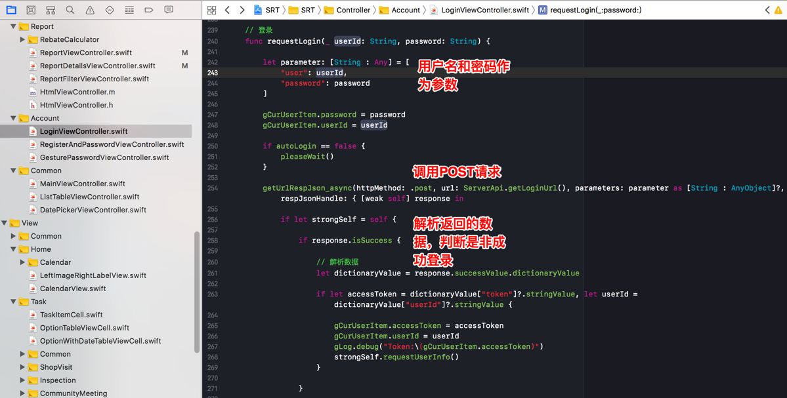

# HTTP简介

`HTTP`=`Hyper Text Transfer Protocol`=`超文本传输协议`

HTTP的总体思路是：

- 客户端：向服务器发送一个`请求`=`Request`，请求头包含请求的方法、URI、协议版本、以及包含请求修饰符、客户信息和内容的类似于MIME的消息结构。
- `服务器`：以一个状态行作出`响应`=`Response`，相应的内容包括消息协议的版本，成功或者错误编码加上包含服务器信息、实体元信息以及可能的实体内容。

简而言之就是一个你问我答的协议：
- 客户端Client 问=`请求`=`Request`
- 服务器Server 答=`响应`=`Response`

关于HTTP的相关的详细知识，或许很多人不是很熟悉。
但是：
- 作为普通电脑用户的你，经常用`浏览器`（`IE`/`Chrome`/`Firefox`等）去浏览网页时
- 作为程序开发，用网络库去调用服务器后台提供的接口时
其实内部都用到了HTTP的技术。

比如一些典型情况：

## 普通用户用浏览器去查看网页
比如用户在用浏览器去打开网址：
[www.baidu.com](http://www.baidu.com)
去查看网页内容：

## 程序员写代码去调用后台接口
比如 （卓越一线的iOS的）swift代码中利用`Alamofire`的HTTP网络库，去实现：

传递用户名ID+密码的参数和POST类型，调用Alamofire发送请求，完成用户的登录

