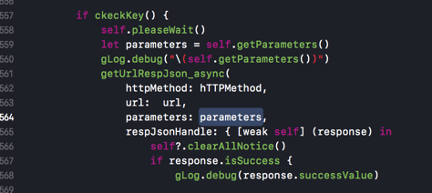
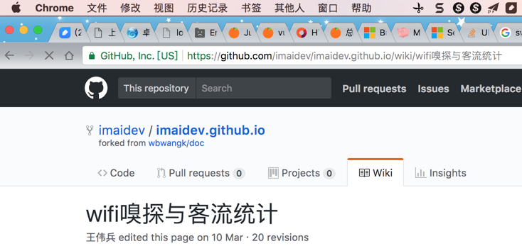
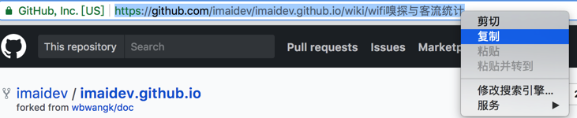
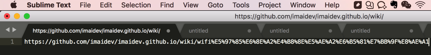

# HTTP的请求参数和参数编码

下面介绍HTTP的请求参数`Request Parameters`和请求参数的编码`Request Parameters Encoding`

## GET的请求的参数：`query string`

典型的是：

GET：参数想要放在url中以`?key1=value1&key2=value2`的形式

则有两种做法：

* 自己把参数组合成对应的格式，放到url中
* 把参数（字典，对象等）调用url encode函数去编码，生成对应的格式（再放到url中）

> #### info::GET的一般特点
> * GET 请求有长度限制
>   * 所以query string一般被限制在1024个字节
>     * 超过限制则后台无法解析参数
> * GET 请求可被缓存
> * GET 请求保留在浏览器历史记录中
> * GET 请求可被收藏为书签
> * GET 请求不应在处理敏感数据时使用
> * GET 请求只应当用于取回数据

## POST的请求的参数：`post body`

典型的是：把一堆的参数，放到`post`的`body`中，格式一般都是`json`格式

则一般也有两种做法：

* 自己把参数（对象，字典等），转换为对应的json字符串
* 调用库提供的方法去encode你的参数对象为json

其他一些解释：
> #### info::POST的一般特点
> * POST 请求不会被缓存
> * POST 请求不会保留在浏览器历史记录中
> * POST 不能被收藏为书签
> * POST 请求对数据长度没有要求

## GET和POST的请求的参数的编码

举例：

### http库axios中create时支持的config中的paramsSerializer

就支持利用其他序列化的库，比如：

* Javascript中的：
  * qs库
    * [https://www.npmjs.com/package/qs](https://www.npmjs.com/package/qs)
    * 举例：
      * `Qs.stringify(params, {arrayFormat: 'brackets'})`

### Alamofire中，对于get的参数支持url encoding，对于post支持json encoding

所以代码可以写成：

```swift
    var paramEncoding:ParameterEncoding = JSONEncoding.default
    if (httpMethod == .get) {
        paramEncoding = URLEncoding.default
    }

let curHttpReq = Alamofire.request(url, method: httpMethod, parameters: parameters, encoding: paramEncoding, headers: curHeaders)
```


然后从外部调用时，对于get的url参数，可以直接传递：

get中的url的参数的对象，让Alamofire内部去利用URLEncoding转换为对应的?key1=value1&key2=value2的格式：

```swift
var parameters = [String : AnyObject]()
parameters = [
    "planId":self.visitId as AnyObject,
    "name":self.missionInfo.missionInfo.name as AnyObject,
    "pics":pics as AnyObject,
    "publisher":gCurUserItem.userInfo.pkEmpno as AnyObject,
    "resultDescription":self.missionInfo.missionInfo.resultDescription as AnyObject,
    "finish":finishInt as AnyObject,
    "planProblem":planProblem as AnyObject
]

getUrlRespJson_async(
    httpMethod: hTTPMethod,
    url:  url,
    parameters: parameters,
    respJsonHandle: { [weak self] (response) in
```



另外，对应的对于POST来说，把json对象转换为json字符串的例子：

```swift
let parameters = [
    "id":self.missionInfo.missionProblem.id as AnyObject,
    "checkPlanId":self.checkPlanId as AnyObject,
    "checkResult":self.resultCell.textview.text as AnyObject,
    "pass":self.pass as AnyObject ,

] as [String : AnyObject]?

getUrlRespJson_async(
    httpMethod: .post,
    url:  ServerApi.getProblemIdResult(visitId: self.visitId,problemId: self.missionInfo.missionProblem.id),
    parameters: parameters ,
    respJsonHandle: { [weak self] (response) in
```

  
则内部的Alamofire就会把该参数对象，通过JSONEncoding转换为json字符串了。

举例：  
python中，get中url参数可以利用`urllib.urlencode`（或`urllib.quote_plus`）去把dict字典转换为key=value的形式：

```python
import urllib
params = urllib.urlencode({'spam': 1, 'eggs': 2, 'bacon': 0})
url = "http://www.musi-cal.com/cgi-bin/query?%s"; % params
```

## 关于HTTP参数编码的常见场景和问题

### 空格应该被encode编码为`+`还是`%20`？

如果你接触Python的url的encode比较多，可能会注意到一个现象：

好像空格有时候被编码为+，有时候被编码为%20，到底哪个才对？

Percent Encode也被叫做URL Encode  
Percent Encode指的是，一些字符，在被（url）encode后，往往都是变成%xx  
比如：  
内部对应着HTTP请求时，类型被设置为：`application/x-www-form-urlencoded`

表格太长，分两个

| [!](https://en.wikipedia.org/wiki/Exclamation_mark) | [\#](https://en.wikipedia.org/wiki/Number_sign) | [$](https://en.wikipedia.org/wiki/Dollar_sign) | [&](https://en.wikipedia.org/wiki/Ampersand) | ['](https://en.wikipedia.org/wiki/Apostrophe_%28mark%29) | [\(](https://en.wikipedia.org/wiki/Parenthesis) | [\)](https://en.wikipedia.org/wiki/Parenthesis) | [\*](https://en.wikipedia.org/wiki/Asterisk) | [+](https://en.wikipedia.org/wiki/Plus_sign) |
| :--- | :--- | :--- | :--- | :--- | :--- | :--- | :--- | :--- |
| %21 | %23 | %24 | %26 | %27 | %28 | %29 | %2A | %2B |

和：

| [,](https://en.wikipedia.org/wiki/Comma) | [/](https://en.wikipedia.org/wiki/Slash_%28punctuation%29) | [:](https://en.wikipedia.org/wiki/Colon_%28punctuation%29) | [;](https://en.wikipedia.org/wiki/Semicolon) | [=](https://en.wikipedia.org/wiki/Equal_sign) | [?](https://en.wikipedia.org/wiki/Question_mark) | [@](https://en.wikipedia.org/wiki/@) | [&#91;](https://en.wikipedia.org/wiki/Square_bracket) | [\]](https://en.wikipedia.org/wiki/Square_bracket) |
| :--- | :--- | :--- | :--- | :--- | :--- | :--- | :--- | :--- |
| %2C | %2F | %3A | %3B | %3D | %3F | %40 | %5B | %5D |

而其他常见的字符被编码后的效果是：

| [newline](https://en.wikipedia.org/wiki/Newline) | [space](https://en.wikipedia.org/wiki/Space_%28punctuation%29) | ["](https://en.wikipedia.org/wiki/Double_quote) | [%](https://en.wikipedia.org/wiki/Percent_sign) | [-](https://en.wikipedia.org/wiki/Hyphen) | [.](https://en.wikipedia.org/wiki/Full_stop) | [&lt;](https://en.wikipedia.org/wiki/Angle_bracket) | [&gt;](https://en.wikipedia.org/wiki/Angle_bracket) |
| :--- | :--- | :--- | :--- | :--- | :--- | :--- | :--- |
| %0A or %0D or %0D%0A | %20 | %22 | %25 | %2D | %2E | %3C | %3E |
和

| [\](https://en.wikipedia.org/wiki/Back_slash) | [&#94;](https://en.wikipedia.org/wiki/Caret) | [\_](https://en.wikipedia.org/wiki/Underscore) | [\`](https://en.wikipedia.org/wiki/Grave_accent) | [{](https://en.wikipedia.org/wiki/Curly_bracket) | [&#124;](https://en.wikipedia.org/wiki/Vertical_bar) | [}](https://en.wikipedia.org/wiki/Curly_bracket) | [~](https://en.wikipedia.org/wiki/Tilde) |
| :--- | :--- | :--- | :--- | :--- | :--- | :--- | :--- |
| %5C | %5E | %5F | %60 | %7B | %7C | %7D | %7E |

即：

空格正常情况下被url encode=percent encode，的结果是%20

但是之所以有时候会看到+是因为：

历史上，最早的网页技术中，在表单form被（通过HTTP的GET／POST等请求，或者是邮件发送）提交时，键key和值value，都是被percent encode=url encode的

对应着类型是：`application/x-www-form-urlencoded`

但是后来有些变种的处理，其中就包括把空格space编码为+（而不是%20）

> **[success] 空格被编码的逻辑的历史**
> * 空格被url encode=percent encode，应该是：**%20**
> * 而之前历史上有些变种的处理，会编码为：**+**

而Python中对于url encode相关的函数有3种，对应的效果分别如下：

```python
#!/usr/bin/python
# -*- coding: utf-8 -*-

import urllib

paraValue = "Crifan Li"
queryPara = { "name" :  paraValue }
urlEncodedQueryPara = urllib.urlencode(queryPara)
print "urlEncodedQueryPara=%s"%(urlEncodedQueryPara) # urlEncodedQueryPara=name=Crifan+Li
quotedValue = urllib.quote(paraValue) # quotedValue=Crifan%20Li
quotedPlusValue = urllib.quote_plus(paraValue) # quotedPlusValue=Crifan+Li
print "quotedValue=%s,quotedPlusValue=%s"%(quotedValue, quotedPlusValue)
```

> **[success] 空格被编码**
> * `urllib.urlencode`编码（字典中的）value
>   * `urllib.quote_plus`编码字符串：空格编码为**+**
> * `urllib.quote`编码字符串：空格编码为**%20**

### 在url地址里包含中文时的编码显示和内部逻辑

背景：  
如果url地址中有非普通的ASCII字符串，理论上都是会被编码后，所以你看到的如果url地址中有中文，实际上打开都是%xx之类的地址  
中文字符串和其他字符串编码逻辑是一样的。

对于中文类字符被url encode，有很多在线网站可以帮你实现，比如：

* `http://tool.chinaz.com/tools/urlencode.aspx`
* `http://tool.oschina.net/encode?type=4`

输入中文**李茂**就可以被（UTF-8）编码为：`%e6%9d%8e%e8%8c%82`


  


> **[success] 提示**
> * 一般网页地址中的字符编码都用的是UTF-8
> * 上面编码也都是采用的UTF-8编码得到的结果

而如果想要换成别的编码，比如另一种常见的中文编码GB2312，则编码出来的是另外的结果：  


> **[success] 同样字符串的不同编码的效果**
> * 李茂 -》 `UTF-8`编码后 -》`%e6%9d%8e%e8%8c%82`
> * 李茂 -》 `GB2312`编码后 -》 `%c0%ee%c3%af`

### 为何浏览器中的地址栏中的url地址可以看到有中文，而不是url encode之后的%xx？

而你在浏览器中看到的中文地址其实是浏览器帮你解码后的中文  
真正的url地址是%xx形式的被（UTF-8）编码后的地址  
比如你在Chrome（或其他浏览器）中看到的地址中有中文：  
`https://github.com/imaidev/imaidev.github.io/wiki/wifi嗅探与客流统计`



实际上内部真正的地址是：

[https://github.com/imaidev/imaidev.github.io/wiki/wifi%E5%97%85%E6%8E%A2%E4%B8%8E%E5%AE%A2%E6%B5%81%E7%BB%9F%E8%AE%A1](https://github.com/imaidev/imaidev.github.io/wiki/wifi嗅探与客流统计)

-》你可以通过，在地址栏中右键-》复制  
  
再粘贴到别的文本工具中，而得到看到真正的被编码后的地址：  
  
类似的，把该地址去（利用前面说的在线网站帮忙）解码也可以得到同样的中文：

[http://tool.oschina.net/encode?type=4](http://tool.oschina.net/encode?type=4)  


