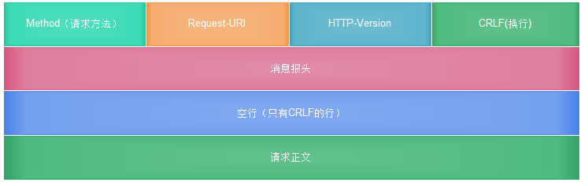

# HTTP基本逻辑总结
上述的所有用浏览器访问网页，用代码调用后台接口去登录等等，其内部的HTTP的基本逻辑和核心流程都是一样的：
## （客户端）发送请求Request
HTTP协议规定request的格式：


此处：
```bash
GET / HTTP/1.1
...
User-Agent: curl/7.54.0
Accept: */*
```
其中：
- `GET`：方法类型，HTTP/1.1表示HTTP协议的版本是1.1
    - 使用第三方库时，也需要制定对应的GET／POST／。。。
    - 现在多数的HTTP协议都是使用的1.1
- `User-Agent`：用户代理，表示自己的客户端的类型是curl
    - 使用第三方库时，一般不需要设置此参数
        - 第三方库会自动帮你设置
    - 如果是浏览器的话，不同浏览器对应不同的预设值
        - 比如上面的Chrome此处是：
            - User-Agent: Mozilla/5.0 (Macintosh; Intel Mac OS X 10_12_6) AppleWebKit/537.36 (KHTML, like Gecko) Chrome/61.0.3163.100 Safari/537.36
- `Accept`：声明自己接收的信息的类型为*/*，表示所有类型内容都运行
    - 如果调用服务器接口时，往往设置为：application/json

## 获得（服务器返回的）响应Response
HTTP协议规定的响应的格式：


举例：


此处的：

```bash
< HTTP/1.1 200 OK
。。。
< Content-Type: text/html
< Content-Length: 2381
。。。。
<
<!DOCTYPE html>
<!--STATUS OK--><html> <head><meta http-equiv=content-type content=text/html;charset=utf-8>........ </body> </html>
* Connection #0 to host www.baidu.com left intact
```
其中：
- HTTP/1.1 200 OK：表示1.1版本的HTTP协议，返回状态为200，表示正常
    - 其他典型的，不正常的，有问题的状态有很多，比如404找不到，500服务器内部错误等等
- Content-Type: text/html：内容的类型为html
- Content-Length: 2381：内容的长度为2381字节
- <!DOCTYPE html>...：html的内容，浏览器加载此内容后，即可显示出你所看到的网页
