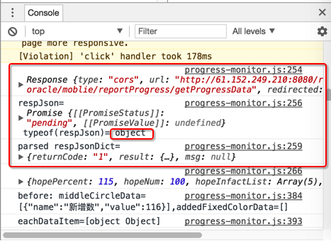

# HTTP库

此处整理不同编程语言的HTTP方面的库：

### `iOS`的`swift`／`Obj-C`

* 第三方
  * [Alamofire](https://github.com/Alamofire/Alamofire)
* swift
  * [SwiftHTTP](https://github.com/daltoniam/SwiftHTTP)

### Python

* 内置
  * Python 3
    * https://docs.python.org/3/library/urllib.html
  * Python 2
    * urllib
      * https://docs.python.org/2/library/urllib.html
    * urllib2
      * https://docs.python.org/2/library/urllib2.html
* 第三方
    * [Requests](https://github.com/requests/requests)
* 详见独立教程
  * [Python心得：http网络库](http://book.crifan.com/books/python_summary_http_lib/website)

### JavaScript

* 好用的
  * axios
    * https://github.com/axios/axios
* 其他的
  * Request
    * https://github.com/request/request
  * Web API的Fetch
    * https://developer.mozilla.org/en-US/docs/Web/API/Fetch_API
  * SuperAgent
    * https://github.com/visionmedia/superagent
  * fetch
    * https://github.com/github/fetch
      * 举例
          ```js
          import ‘whatwg-fetch’;
              fetch(
              ‘http://xxxxx/getProgressData’,
              {
                  method : ‘POST’,
                  headers : {
                  ‘Content-Type’: ‘application/x-www-form-urlencoded; charset=UTF-8’,
                  ‘Accept’: ‘application/json’
                  },
                  body: ‘currTime=2017-08-25&orgCode=SK316005’
              }
              )
              .then((resp) => {
              console.log(resp);
              let respJson = resp.json(); //typeof(respJson)= object
              console.log(‘respJson=’, respJson, ‘typeof(respJson)=’, typeof(respJson));
              return respJson;
              })
              .then((respJsonDict) => {
              console.log(‘parsed respJsonDict=’, respJsonDict);
              });
          ```
      * 效果
        * 返回的是object对象，是Response类型，其中json()之后得到的是Promise对象，也就是可以直接拿来使用的json对象了，然后就可以进行后序数据处理了
          * 

### C&#35;

- [HttpWebRequest](https://msdn.microsoft.com/en-us/library/system.net.httpwebrequest&#40;v=vs.110&#41;.aspx)
* crifan的lib的C#的http的部分
  * [第 9 章 crifanLib.cs之Http](https://www.crifan.com/files/doc/docbook/crifanlib_csharp/release/html/crifanlib_csharp.html#http)
