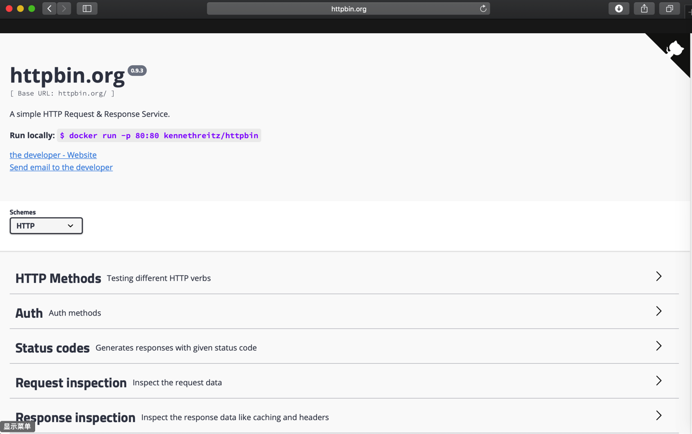
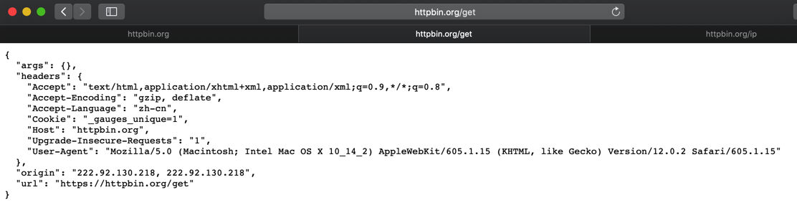
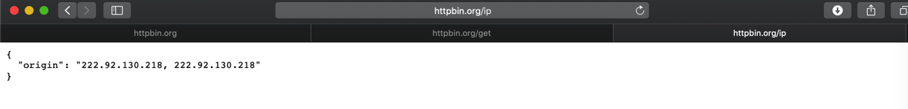
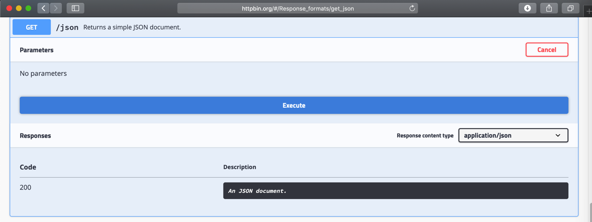

# HTTP工具

此处整理HTTP相关的库和工具：

## Postman

可用于服务器端和其他移动端等，调试接口数据返回是否正常

举例：比如用Postman去调试奶牛云的后台的登录接口：


更多内容详见另外的教程：[API开发利器：Postman](http://book.crifan.com/books/api_tool_postman/website/)

## Chrome的开发者工具Developer Tools

调试页面内容是否正常，包括布局，参数等等

详见：[【总结】浏览器中的开发人员工具（IE9的F12和Chrome的Ctrl+Shift+I）-网页分析的利器](https://www.crifan.com/browser_developer_tool_chrome_vs_ie9/)

## curl

模拟去请求服务器数据的命令行工具

## HTTPie

后来从[jobbole/awesome-python-cn: Python资源大全中文版](https://github.com/jobbole/awesome-python-cn)中知道了还有个`HTTPie`

* Github: [jakubroztocil/httpie: Modern command line HTTP client](https://github.com/jakubroztocil/httpie)
* 官网：[HTTPie – command line HTTP client](https://httpie.org)
* 简介：
    * > HTTPie is a command line HTTP client with an intuitive UI, JSON support, syntax highlighting, wget-like downloads, plugins, and more

看了下，比curl更好用，更方便。值得推荐。

## Httpbin

Httpbin 是一个网站：

http://httpbin.org/

用于测试http各方面的内容。

首页：



比如：


### get

测试get方法：

http://httpbin.org/get

返回各种信息，包括headers

```json
{
  "args": {}, 
  "headers": {
    "Accept": "text/html,application/xhtml+xml,application/xml;q=0.9,*/*;q=0.8", 
    "Accept-Encoding": "gzip, deflate", 
    "Accept-Language": "zh-cn", 
    "Cookie": "_gauges_unique=1", 
    "Host": "httpbin.org", 
    "Upgrade-Insecure-Requests": "1", 
    "User-Agent": "Mozilla/5.0 (Macintosh; Intel Mac OS X 10_14_2) AppleWebKit/605.1.15 (KHTML, like Gecko) Version/12.0.2 Safari/605.1.15"
  }, 
  "origin": "222.92.130.218, 222.92.130.218", 
  "url": "https://httpbin.org/get"
}
```



目的和作用：可以通过你的代码或工具中，去调用 http://httpbin.org/get ，从返回的值中，确认你的接口调用GET时的各种参数，是否符合你的预期

### ip

去测试当前IP：

http://httpbin.org/ip

返回：

```json
{
  "origin": "222.92.130.218, 222.92.130.218"
}
```



用途举例：

【已解决】PySpider中使用多贝云IP代理池实现每次请求IP都不同

中就利用了：

http://httpbin.org/ip

去获取当前（代理）的IP，来确认每次通过代理访问时，代理IP地址是否正确，代理是否真的生效了。

### json

你想要测试，返回json数据，写代码去解析json

可以用：

http://httpbin.org/json

返回json数据供你解析和测试代码

同时，该网页上还有测试界面供你测试数据效果：



点击Execute后效果：


